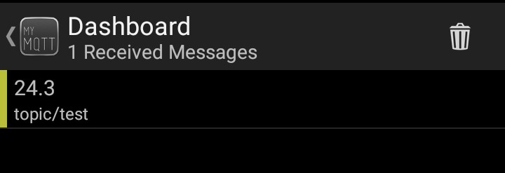

## IOT

### Setting Up Locally:
1. Creating the Virtual Environment
2. python -m venv env
3. Activating the Environment
4. env\Scripts\activate

### Dependencies:
```
- pip install paho-mqtt
- pip install numpy
- pip install pandas
- pip install sklearn

```
### Test:

The first concept is the publish and subscribe system. In a publish and subscribe system, a device can publish a message on a topic, or it can be subscribed to a particular topic to receive messages

1. For example Device 1 publishes on a topic.
2. Device 2 is subscribed to the same topic as device 1 is publishing in.
3. So, device 2 receives the message.

#### Workflow


**1. Mqtt-Publish/mqtt-publish.py**



**2. Mqtt-Subscribe/mqtt-subscribe.py**


